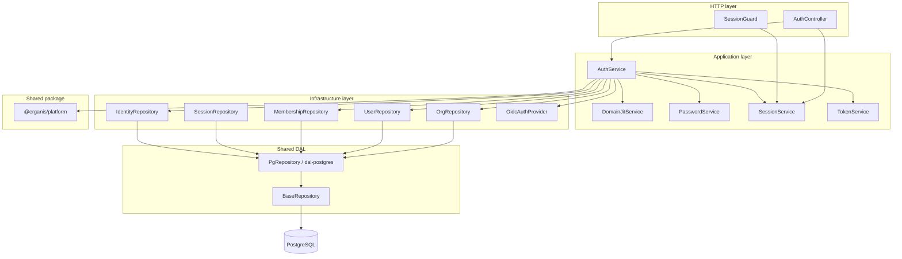
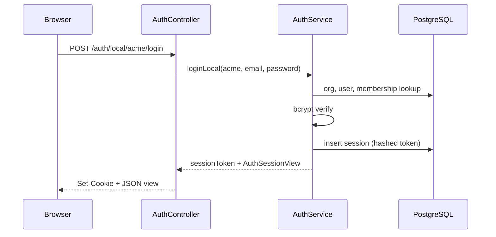
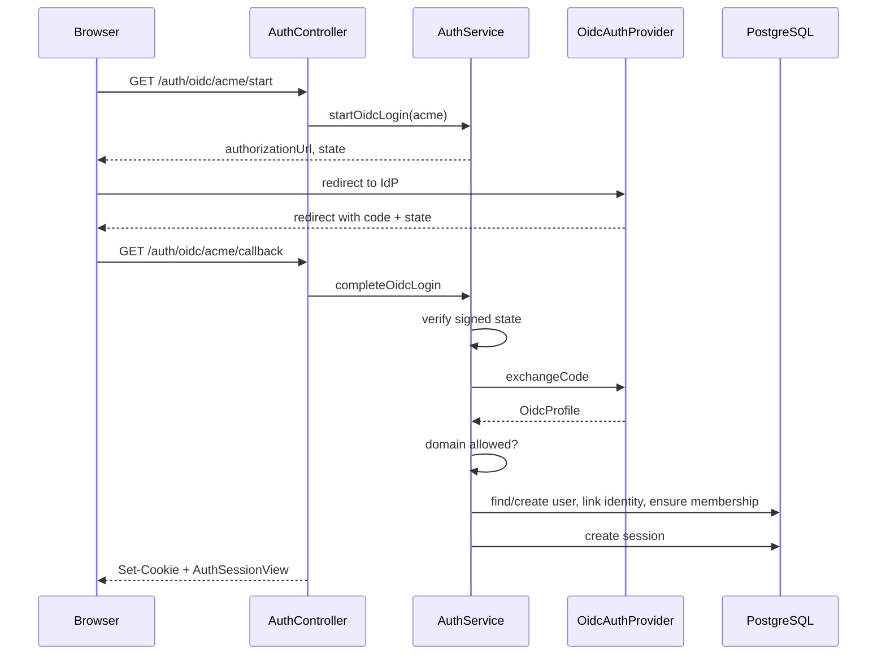
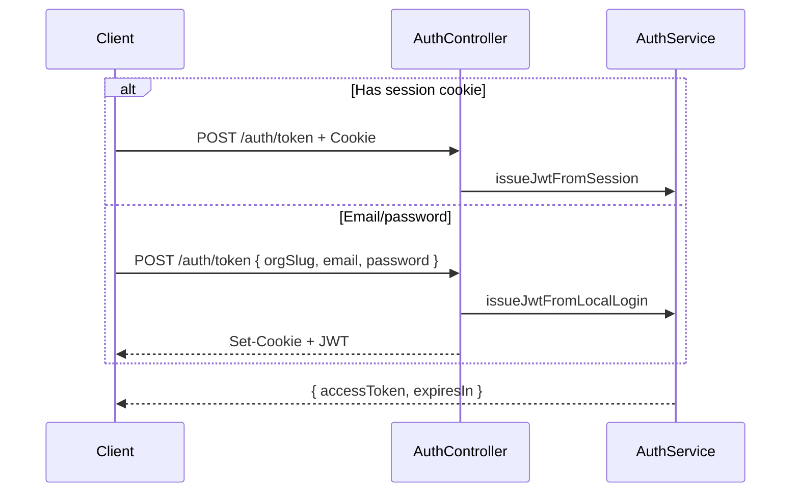

# Phase 1 Auth — Architecture Reference

> **Status:** Phase 1 complete; DAL foundation (`BaseRepository`, `@erganis/dal-postgres`) landed early for Phase 2.  
> **Companions:** [`PHASE-1.md`](./PHASE-1.md) (delivery checklist) · [`PHASE-2.md`](./PHASE-2.md) (loader + envelope smoke) · [`data/dal/README.md`](../../data/dal/README.md) (module author guide).

This document explains the Phase 1 authentication system and how it connects to Core’s shared data-access layer: folder layout, shared types, classes, interfaces, database tables, and request flows.

---

## Glossary

Plain-language definitions for terms used throughout this document. Erganis-specific names are included where relevant.

| Term | Meaning |
|------|---------|
| **Authentication (authn)** | Proving *who you are* — e.g. logging in with a password or through Google/Microsoft. |
| **Authorization (authz)** | Deciding *what you are allowed to do* after you are logged in — e.g. “admin can edit, viewer can only read.” Phase 1 stores roles and permissions; full enforcement comes in later phases. |
| **OIDC (OpenID Connect)** | A modern standard for “Sign in with Google/Microsoft/Okta.” The user is sent to an external **identity provider**, approves access, and is sent back with a proof of identity. Erganis uses OIDC as the primary login method. |
| **OAuth 2.0** | The underlying protocol OIDC is built on. You may see “OAuth” in product docs; for login we care about the OIDC layer on top of it. |
| **IdP (Identity Provider)** | The external service that actually verifies the user — e.g. Google Workspace, Microsoft Entra ID, Okta. Erganis trusts the IdP and then creates or links a local user record. |
| **SAML** | An older enterprise single sign-on (SSO) standard, common in large corporations. Not implemented in Phase 1, but the code is structured so a SAML provider could be added later alongside OIDC. |
| **Local login / local fallback** | Username-and-password login handled entirely by Erganis (stored in our database), without sending the user to an external IdP. Intended for development, testing, and emergency access — not the primary production path. |
| **JWT (JSON Web Token)** | A compact, signed string that proves a user is logged in. API clients (mobile apps, scripts, integrations) send the JWT on each request in an `Authorization` header. JWTs expire after a short time (`JWT_TTL_SECONDS`). |
| **Session** | A server-side record that says “this browser is logged in as user X until time Y.” The browser holds a **session cookie**; the server holds the real session data in Postgres. |
| **Session cookie** | A small piece of data the browser stores and sends back automatically on every request to Erganis. Default name: `erganis_session`. Used by web apps (Studio, portals) — not typically by raw API clients. |
| **HttpOnly cookie** | A cookie flag that prevents JavaScript from reading it, which reduces theft via cross-site scripting (XSS). Erganis session cookies are HttpOnly. |
| **Domain JIT (Just-In-Time provisioning)** | When someone signs in via OIDC for the first time, Erganis can **automatically create their user account** if their email domain (e.g. `@acme.com`) is on the org’s allowlist. “JIT” = created at login time, not pre-invited. |
| **Org (organization)** | A customer / tenant in Erganis — e.g. “Acme Corp.” Users belong to orgs through **memberships**. Each org has its own auth settings and allowed email domains. |
| **Tenant / multi-tenant** | One Erganis installation serves many orgs. Data and access are separated per org; a user may belong to more than one org. |
| **Slug** | A short, URL-friendly org identifier — e.g. `acme` in `/auth/local/acme/login`. Human-readable; unique across all orgs. |
| **Membership** | The link between a **user** and an **org**, including which **role** they have in that org. A user needs a membership to log into an org. |
| **Role** | A named bundle of permissions inside an org — e.g. `admin`, `member`. Phase 1 ensures every org has an `admin` role; Studio will manage custom roles later. |
| **Admin role** | The built-in org administrator role (`is_admin = true`). Domain-JIT users get this role by default when they are the first to join an org (Phase 1 bootstrap behavior). |
| **Public ID** | An external-facing identifier like `user_01HXYZ…` or `org_01HABC…`. Safe to expose in APIs and JWTs. Never expose internal database UUIDs to clients. |
| **UUID** | Internal database primary key (e.g. `a1b2c3d4-…`). Used for joins inside Postgres; not shown in API responses. |
| **bcrypt** | A standard algorithm for hashing passwords before storage. Erganis never stores plain-text passwords — only a bcrypt **hash** that can be verified at login. |
| **Authorization code** | A one-time code the IdP sends back to Erganis after login. Erganis exchanges it with the IdP for identity details (part of the OIDC flow). |
| **Callback / redirect URI** | The URL the IdP sends the user back to after login — e.g. `http://localhost:5000/auth/oidc/acme/callback`. Must be registered with the IdP. |
| **State (OIDC)** | A signed, short-lived value Erganis generates when starting OIDC login. Prevents cross-site request forgery (CSRF) by ensuring the callback matches the login we started. |
| **Mock IdP** | A fake identity provider used in tests and local dev (`AUTH_OIDC_MOCK=true`). Accepts special codes like `mock-code:user@acme.com` instead of calling a real Google/Microsoft server. |
| **DTO (Data Transfer Object)** | A TypeScript shape describing data sent over the wire — e.g. `AuthSessionView` returned after login. Not a database row; a API-friendly view. |
| **Interface** | A TypeScript contract listing fields/methods without implementation — e.g. `OidcAuthProvider` defines what any OIDC adapter must do. |
| **Repository** | A class that reads/writes one area of the database (orgs, users, sessions, etc.). Keeps SQL out of business logic. Auth repos **extend `PgRepository`**, which extends Core’s **`BaseRepository`**. |
| **BaseRepository** | Core base class in `@erganis/platform` — provides `queryOne`, `queryMany`, `execute`, and `qualifiedTable`. Module authors extend this for their schema. |
| **DbUnitOfWork** | A single database transaction shared across repositories. The orchestrator opens/commits/rolls back; module code never calls `BEGIN`/`COMMIT` directly (Phase 2+). |
| **QueryClient** | Small interface (`query(sql, params)`) that repositories use instead of importing `pg` directly. |
| **PgRepository** | Convenience subclass of `BaseRepository` in `@erganis/dal-postgres` — constructor takes a `pg` Pool. Auth repos use this; module repos often use `BaseRepository` + `QueryClient` instead. |
| **`@erganis/dal-postgres`** | Core package (`core/data/dal/`) that adapts `pg` Pool/PoolClient to `QueryClient`, provides `PgRepository`, `PgUnitOfWorkFactory`, and Nest factory helpers. |
| **Service (application service)** | Business logic class — e.g. `AuthService` orchestrates login rules; `PasswordService` handles bcrypt. |
| **Controller** | HTTP adapter — maps URLs and JSON bodies to service calls and sets cookies on responses. |
| **Guard** | NestJS middleware that runs before a route — e.g. `SessionGuard` blocks `/auth/me` unless a valid session cookie is present. |
| **Module** | NestJS grouping of controllers, services, and providers that wire together — e.g. `AuthModule`. |
| **Provider** | In NestJS, an injectable dependency — e.g. the OIDC implementation swapped between mock and real HTTP. |
| **Migration** | A versioned SQL script that creates or updates database tables. `001_platform_auth.sql` creates all Phase 1 auth tables. |
| **Schema (database)** | A namespace inside Postgres. Phase 1 uses the `platform` schema for orgs, users, sessions, etc. |
| **Postgres / PostgreSQL** | The relational database Erganis uses. Auth sessions, users, and org data live here. |
| **NestJS (Nest)** | The Node.js framework used for Core services — provides modules, controllers, guards, dependency injection. |
| **Express** | The underlying HTTP library Nest uses. `cookie-parser` is Express middleware for reading cookies. |
| **`@erganis/platform`** | Shared TypeScript package (types + public ID helpers) used by Core and, later, Studio/modules — without importing Nest. |
| **Layer / layering** | Code organized by responsibility: HTTP → application logic → database/external APIs. Makes testing and changes easier. |
| **Ports and adapters** | Same idea as layering: business rules don’t talk to Postgres directly; they talk to **repositories** and **providers** (adapters). |
| **TTL (time to live)** | How long something remains valid — e.g. session TTL (24h default) or JWT TTL (1h default). |
| **CI (Continuous Integration)** | Automated tests on every push (GitHub Actions). Auth e2e tests run against a real Postgres container with the mock IdP enabled. |
| **E2E (end-to-end) test** | Test that hits the running app over HTTP with a real database — closer to production than unit tests. |
| **Unit test** | Test of one class in isolation, often with mocked dependencies. Every auth class has a `*.spec.ts` file. |
| **Env var (environment variable)** | Configuration read from the environment — e.g. `JWT_SECRET`, `DATABASE_URL` in `.env` or CI. |
| **Break-glass** | Emergency access path when SSO is down — local login can serve this role if enabled. |

---

## 1. Design goals

Phase 1 establishes **platform identity** in Core — not Studio UI or module-specific auth.

| Goal | How it is met |
|------|----------------|
| **OIDC v1** as primary login | `OidcAuthProvider` + per-org `org_oidc_config` |
| **Local fallback** for dev / break-glass | `POST /auth/local/:orgSlug/login` with bcrypt passwords |
| **Web sessions** | HttpOnly cookie (`erganis_session` by default) |
| **Public API access** | Short-lived JWT (`POST /auth/token`) |
| **Multi-tenant orgs** | Org slug in URL; membership checked per org |
| **Domain JIT** | OIDC users auto-provisioned when email domain ∈ `allowed_domains` |
| **Admin role** | First JIT user gets org `admin` role if no membership exists |
| **SAML-ready** | Provider abstraction (`OidcAuthProvider`); SAML not implemented yet |
| **Testability** | Mock IdP in dev/CI; unit spec per class |

**Out of scope (Phase 1):** Studio admin UI for org/role CRUD, SAML, API keys, refresh tokens, MFA.

---

## 2. Repository layout

```
core/
├── data/
│   ├── dal/                           # @erganis/dal-postgres
│   │   └── src/                       # PgRepository, PgUnitOfWorkFactory, Nest helpers
│   └── migrations/
│       └── 001_platform_auth.sql      # platform schema DDL
├── packages/typescript/               # @erganis/platform (no Nest, no pg)
│   └── src/
│       ├── auth-types.ts              # shared auth DTOs / claims
│       ├── public-id.ts               # public ID helpers
│       ├── dal/                       # QueryClient, BaseRepository, DbUnitOfWork
│       └── index.ts
└── services/                          # @erganis/core-services (Nest)
    └── src/
        ├── app.module.ts              # imports AuthModule
        ├── main.ts                    # cookie-parser middleware
        ├── config/configuration.ts    # env → config object
        └── modules/
            ├── database/
            │   ├── database.service.ts
            │   ├── database.module.ts
            │   └── migration.runner.ts
            └── auth/
                ├── auth.module.ts     # createPoolRepository wiring
                ├── application/       # business logic (no SQL)
                ├── controllers/       # HTTP adapters
                ├── guards/            # Nest guards
                └── infrastructure/    # repos extend PgRepository + OIDC I/O
```

### Layering

Phase 1 auth follows a simple **ports and adapters** split inside the Nest module:



- **Controllers** translate HTTP ↔ application calls; set/clear cookies.
- **Application services** encode auth rules; depend on repositories and providers, not raw SQL.
- **Infrastructure** owns domain SQL and external OIDC HTTP calls; repositories extend **`PgRepository`** → **`BaseRepository`**.
- **`@erganis/platform`** holds types, public IDs, and DAL interfaces (no `pg`, no Nest).
- **`@erganis/dal-postgres`** connects repositories to Postgres and provides transaction scope for Phase 2 envelope steps.

---

## 3. Shared package (`@erganis/platform`)

Published locally as `file:../packages/typescript`. Built before services compile.

### `public-id.ts`

Stable, type-prefixed identifiers exposed in APIs (never internal UUIDs).

| Function | Purpose |
|----------|---------|
| `createPublicId(type)` | Returns `{type}_{ulid}`, e.g. `user_01H…` |
| `isValidPublicId(value)` | Regex validation |
| `parsePublicIdType(value)` | Extracts `user` from `user_01H…` |

Used when creating `users` and `orgs` rows (`UserRepository.createUser` defaults to `createPublicId('user')`).

### `auth-types.ts`

Cross-runtime contracts — API responses, JWT payload shape, OIDC normalization.

| Export | Kind | Purpose |
|--------|------|---------|
| `AuthMode` | type | `'oidc' \| 'local' \| 'both'` — per-org login policy |
| `AuthProviderType` | type | `'local' \| 'oidc' \| 'saml'` — reserved for future SAML |
| `AuthUser` | interface | Public user slice in session view |
| `AuthOrg` | interface | Public org slice in session view |
| `AuthRole` | interface | Role name, permissions[], `isAdmin` flag |
| `AuthSessionView` | interface | `{ user, org, role }` — returned by login and `/auth/me` |
| `OidcProfile` | interface | Normalized IdP identity after code exchange |
| `JwtClaims` | interface | JWT payload: `sub`, `email`, `orgPublicId`, `role`, `permissions` |

`sub` in JWT is the user's **public ID**, not the internal UUID.

### `dal/` (data access interfaces)

Shared repository contracts — exported from `@erganis/platform`; no `pg` dependency.

| Export | Kind | Purpose |
|--------|------|---------|
| `QueryClient` | interface | `query(sql, params)` — what repositories call |
| `QueryResult` / `QueryResultRow` | types | Raw row shapes from the database |
| `BaseRepository` | class | `queryOne`, `queryMany`, `execute`, `qualifiedTable` |
| `DbUnitOfWork` | interface | Transaction scope with `client`, `commit`, `rollback` |
| `DbUnitOfWorkFactory` | interface | `runInTransaction(work)` — orchestrator entry point (Phase 2+) |

PostgreSQL adapters live in **`@erganis/dal-postgres`** (`core/data/dal/`): `asQueryClient`, `PgRepository`, `PgUnitOfWorkFactory`, `createPoolRepository`, `createClientRepository`.

---

## 4. Database schema (`platform` schema)

Migration: `core/data/migrations/001_platform_auth.sql`  
Applied on startup by `MigrationRunner` (unless `RUN_MIGRATIONS_ON_START=false`).

| Table | Purpose |
|-------|---------|
| `platform.orgs` | Tenant: slug, name, `allowed_domains[]`, `auth_mode` |
| `platform.users` | Global user identity; optional `password_hash` for local login |
| `platform.roles` | Per-org role definitions; `is_admin` flag |
| `platform.org_memberships` | Links user ↔ org ↔ role (unique per org+user) |
| `platform.sessions` | Server-side sessions; stores **SHA-256 hash** of cookie token |
| `platform.oidc_identities` | Links `(issuer, subject)` → `user_id` |
| `platform.org_oidc_config` | Per-org OIDC client settings |
| `platform.schema_migrations` | Migration version tracking (created by runner) |

### Key constraints

- **Org slug** and **user email** are unique globally.
- **OIDC identity** is unique on `(issuer, subject)`.
- **Membership** is unique on `(org_id, user_id)`.
- Session tokens are never stored in plaintext — only `token_hash`.

### Internal vs public IDs

| Layer | Identifier |
|-------|------------|
| Database joins | UUID (`id` columns) |
| HTTP / JWT | Public ID (`public_id` columns) |

Repositories map snake_case columns → camelCase TypeScript records.

---

## 5. Infrastructure layer

### Shared DAL (Core + module authors)

Shared data-access base classes let third-party modules extend Core instead of hand-rolling SQL plumbing. **Delivered as Phase 2 foundation** (auth repos already use it):

| Package | Exports | Used by |
|---------|---------|---------|
| `@erganis/platform` | `QueryClient`, `BaseRepository`, `DbUnitOfWork`, `DbUnitOfWorkFactory` | Everyone (no `pg`, no Nest) |
| `@erganis/dal-postgres` | `asQueryClient`, `PgRepository`, `PgUnitOfWorkFactory`, `createPoolRepository`, `createClientRepository` | Core services, module runtimes |

**Auth repositories** extend **`PgRepository`** (constructor takes `pg.Pool`) and use inherited `queryOne` / `execute` helpers.

**Module repositories** (recommended pattern) extend **`BaseRepository`** and accept **`QueryClient`** so the same class works:
- outside a transaction — wired via `createClientRepository(Repo, pool)`
- inside envelope `phase: db` steps — `new MyRepository(unitOfWork.client)`

Example module repo skeleton:

```typescript
import { BaseRepository, QueryClient } from '@erganis/platform';

export class WidgetRepository extends BaseRepository {
  static readonly SCHEMA = 'inventory';

  constructor(client: QueryClient) {
    super(client);
  }

  findByPublicId(publicId: string) {
    const table = this.qualifiedTable(WidgetRepository.SCHEMA, 'widgets');
    return this.queryOne(
      `SELECT id, public_id, name FROM ${table} WHERE public_id = $1`,
      [publicId],
      (row) => ({ id: row.id as string, publicId: row.public_id as string, name: row.name as string }),
    );
  }
}
```

See [`data/dal/README.md`](../../data/dal/README.md) and [`PHASE-2.md`](./PHASE-2.md).

### Repository records (internal DTOs)

Defined alongside repositories; not exported from `@erganis/platform`.

| Record | File | Fields (high level) |
|--------|------|---------------------|
| `OrgRecord` | `org.repository.ts` | `id`, `publicId`, `slug`, `name`, `allowedDomains`, `authMode` |
| `OrgOidcConfigRecord` | `org.repository.ts` | `orgId`, `issuer`, `clientId`, `clientSecret`, endpoints, `scopes` |
| `UserRecord` | `user.repository.ts` | `id`, `publicId`, `email`, `passwordHash`, `displayName` |
| `RoleRecord` | `org.repository.ts` | `id`, `orgId`, `name`, `permissions`, `isAdmin` |
| `SessionRecord` | `session.repository.ts` | `id`, `userId`, `tokenHash`, `expiresAt` |
| `OidcIdentityRecord` | `identity.repository.ts` | `userId`, `issuer`, `subject` |

### `OrgRepository`

| Method | Behavior |
|--------|----------|
| `findBySlug` / `findById` | Load org for route param resolution |
| `findOidcConfig` | Load OIDC client config for org |
| `createOrg` | Bootstrap / test seeding |
| `upsertOidcConfig` | Insert or update OIDC settings |
| `ensureAdminRole` | Return existing admin role or create `admin` with `is_admin=true` |

### `UserRepository`

| Method | Behavior |
|--------|----------|
| `findByEmail` | Case-insensitive lookup (local login) |
| `findById` / `findByPublicId` | Internal / API lookups |
| `createUser` | JIT provisioning; assigns `createPublicId('user')` |
| `updateDisplayName` | Backfill from OIDC `name` claim |

### `MembershipRepository`

| Method | Behavior |
|--------|----------|
| `findMembership` | Join membership → role for session view |
| `addMembership` | Upsert membership (used by JIT + admin bootstrap) |

### `SessionRepository`

| Method | Behavior |
|--------|----------|
| `generateToken()` | 32-byte base64url random string (cookie value) |
| `hashToken(token)` | SHA-256 hex digest for storage |
| `createSession` | Persist hashed token + `expires_at` |
| `findValidSession` | Match hash where `expires_at > now()` |
| `deleteByToken` | Logout |

### `IdentityRepository`

| Method | Behavior |
|--------|----------|
| `findByIssuerSubject` | Return linked user for returning OIDC login |
| `linkIdentity` | Upsert `(issuer, subject) → user_id` |

### `OidcAuthProvider` (interface)

Symbol token: `OIDC_AUTH_PROVIDER` — injected into `AuthService`.

```typescript
interface OidcAuthProvider {
  buildAuthorizationUrl(config, state, redirectUri): string;
  exchangeCode(config, code, redirectUri): Promise<OidcProfile>;
}
```

| Implementation | When used | Behavior |
|----------------|-----------|----------|
| `MockOidcAuthProvider` | `AUTH_OIDC_MOCK=true` | Codes like `mock-code:user@domain.com` → synthetic profile |
| `HttpOidcAuthProvider` | Production / real IdP | Standard authorization URL; token exchange; parses `id_token` JWT payload |

**SAML extension point:** Add `SamlAuthProvider` implementing the same interface pattern (or a shared `AuthProvider` super-interface in a later phase) and register via config — no changes to `AuthService` orchestration logic required beyond injection.

---

## 6. Application layer

### `DomainJitService`

Pure domain rules for email-domain gating.

| Method | Behavior |
|--------|----------|
| `emailDomain(email)` | Extract and lowercase domain; throw on malformed email |
| `isDomainAllowed(email, allowedDomains)` | `false` if allowlist empty; else case-insensitive match |

Used by `AuthService.resolveOidcUser` before provisioning.

### `PasswordService`

Thin wrapper over **bcryptjs** (cost factor 10).

| Method | Behavior |
|--------|----------|
| `hash(password)` | Store in `users.password_hash` |
| `verify(password, hash)` | Returns `false` if hash is null |

### `TokenService`

JWT operations via **jsonwebtoken**; secret from `JWT_SECRET`.

| Method | Behavior |
|--------|----------|
| `signAccessToken(claims)` | API JWT; TTL from `JWT_TTL_SECONDS` |
| `verifyAccessToken(token)` | Validate and decode (for future guards) |
| `signOidcState(payload)` | Short-lived signed state (`orgSlug`, `nonce`) |
| `verifyOidcState(state)` | CSRF protection on OIDC callback |

### `SessionService`

Cookie and session lifecycle; delegates persistence to `SessionRepository`.

| Method | Behavior |
|--------|----------|
| `createSession(userId)` | Generate token, persist, return raw token for cookie |
| `resolveSessionToken(token)` | Return `userId` or `null` |
| `revokeSession(token)` | Delete session row |
| `cookieName()` | From `SESSION_COOKIE_NAME` |
| `cookieOptions()` | `httpOnly`, `sameSite: lax`, `secure` in production, `maxAge` |
| `clearCookieOptions()` | Same minus `maxAge` (Express 5 deprecation fix) |

### `AuthService` (orchestrator)

Central auth workflow. Returns `LoginResult { sessionToken, view: AuthSessionView }` for login paths.

| Method | Flow summary |
|--------|--------------|
| `loginLocal` | Check local enabled → org exists → auth mode allows local → user + password → membership → session |
| `startOidcLogin` | Org exists → OIDC allowed → config present → sign state → build authorization URL |
| `completeOidcLogin` | Verify state → exchange code → `resolveOidcUser` → session |
| `resolveOidcUser` | Domain check → existing identity link **or** find/create user → link identity → `ensureMembership` |
| `buildSessionView` | Load user + org + role for response DTO |
| `getSessionViewFromToken` | Resolve cookie → `buildSessionView` |
| `logout` | Revoke session |
| `issueJwtFromSession` | Session → `AuthSessionView` → `JwtClaims` → sign |
| `issueJwtFromLocalLogin` | `loginLocal` + sign JWT (also returns session token) |
| `ensureMembership` (private) | If no membership, assign org admin role |

**Security notes:**
- Local login returns generic `Invalid credentials` for unknown user vs bad password.
- OIDC-only orgs reject local login; local-only orgs reject OIDC start.
- JIT users without existing membership receive the org **admin** role (Phase 1 bootstrap default; Studio will manage roles later).

---

## 7. HTTP layer

### `AuthController`

Base path: `/auth`

| Route | Guard | Input | Output / side effects |
|-------|-------|-------|------------------------|
| `POST /local/:orgSlug/login` | — | `{ email, password }` | `AuthSessionView` + `Set-Cookie` |
| `GET /oidc/:orgSlug/start` | — | — | `{ authorizationUrl, state }` |
| `GET /oidc/:orgSlug/callback` | — | `?code=&state=` | `AuthSessionView` + `Set-Cookie` |
| `GET /me/:orgSlug` | `SessionGuard` | Cookie | `AuthSessionView` |
| `POST /logout` | `SessionGuard` | Cookie | `{ ok: true }` + clear cookie |
| `POST /token` | — | Cookie **or** `{ orgSlug, email?, password? }` | `{ accessToken, expiresIn }` |

`main.ts` registers `cookie-parser` globally so `req.cookies` is available.

### `SessionGuard`

| Step | Behavior |
|------|----------|
| 1 | Read session cookie by configured name |
| 2 | `SessionService.resolveSessionToken` |
| 3 | Attach `userId` and `sessionToken` to `AuthenticatedRequest` |
| 4 | Throw `401` if invalid |

Exported from `AuthModule` for reuse by future protected routes (Phase 2+).

### `AuthenticatedRequest`

Extends Express `Request` with optional `userId` and `sessionToken` set by the guard.

---

## 8. Module wiring

### `AuthModule`

- Registers `AuthController`.
- Wires five repositories via **`createPoolRepository(RepoClass, db.getPool())`** from `@erganis/dal-postgres`.
- Binds `OIDC_AUTH_PROVIDER` to `MockOidcAuthProvider` or `HttpOidcAuthProvider` based on `authOidcMock` config.
- **Exports:** `AuthService`, `SessionService`, `SessionGuard` (for other modules).

### `DatabaseModule` (global)

- `DatabaseService` — lazy `pg.Pool` from `DATABASE_URL`.
- `MigrationRunner` — runs SQL files on `OnModuleInit`.

### `AppModule`

```typescript
imports: [ConfigModule, DatabaseModule, HealthModule, AuthModule]
```

---

## 9. Request flows

### Local login (web)



### OIDC login with domain JIT



### JWT for API clients



---

## 10. Configuration

From `services/.env.example` → `configuration.ts`:

| Env var | Config key | Default | Purpose |
|---------|------------|---------|---------|
| `JWT_SECRET` | `jwtSecret` | dev placeholder | Session state + JWT signing |
| `SESSION_COOKIE_NAME` | `sessionCookieName` | `erganis_session` | Cookie name |
| `SESSION_TTL_SECONDS` | `sessionTtlSeconds` | `86400` | Server session lifetime |
| `JWT_TTL_SECONDS` | `jwtTtlSeconds` | `3600` | Access token lifetime |
| `OIDC_CALLBACK_BASE_URL` | `oidcCallbackBaseUrl` | `http://localhost:5000` | Registered redirect base |
| `AUTH_LOCAL_ENABLED` | `authLocalEnabled` | `true` | Kill switch for local login |
| `AUTH_OIDC_MOCK` | `authOidcMock` | `false` | Use `MockOidcAuthProvider` |
| `MIGRATIONS_DIR` | `migrationsDir` | `../data/migrations` | SQL migration path |
| `RUN_MIGRATIONS_ON_START` | — | `true` | Set `false` to skip auto-migrate |
| `DATABASE_URL` | `databaseUrl` | — | Required for auth (pools + migrate) |

---

## 11. Testing map

Every application/infrastructure unit has a co-located `*.spec.ts`. E2E tests live in `services/test/`.

| Area | Spec file | What it proves |
|------|-----------|----------------|
| Public IDs | `packages/.../public-id.spec.ts` | Format, validation |
| DAL base | `packages/.../dal/base-repository.spec.ts` | Query helpers, `qualifiedTable` |
| DAL Postgres | `data/dal/src/*.spec.ts` | `asQueryClient`, `PgUnitOfWorkFactory` |
| Domain JIT | `domain-jit.service.spec.ts` | Allowlist logic |
| Passwords | `password.service.spec.ts` | Hash/verify |
| Tokens | `token.service.spec.ts` | JWT + OIDC state round-trip |
| Sessions | `session.service.spec.ts` | TTL, cookie options |
| OIDC providers | `oidc-auth.provider.spec.ts` | Mock codes, HTTP exchange |
| Repositories | `*.repository.spec.ts` | SQL mapping via mocked pool → `QueryClient` |
| Migration runner | `migration.runner.spec.ts` | Apply/skip logic |
| Auth service | `auth.service.spec.ts` | Local, OIDC JIT, JWT paths |
| Controller | `auth.controller.spec.ts` | Cookie + token HTTP behavior |
| Session guard | `session.guard.spec.ts` | 401 vs attach user |
| E2E | `test/auth.e2e-spec.ts` | Full stack with Postgres seed |

E2E seed helper: `test/helpers/auth-seed.ts` — creates org `acme`, admin user, OIDC config.

---

## 12. Known limitations & next steps

| Topic | Phase 1 behavior | Likely follow-up |
|-------|-------------------|------------------|
| DAL / transactions | `BaseRepository` + `PgUnitOfWorkFactory` ready; orchestrator not wired yet | Phase 2 envelope smoke |
| Role management | Admin bootstrap only; no CRUD API | Studio admin UI (Phase 1+) |
| JWT validation guard | `verifyAccessToken` exists; no global API guard yet | Phase 2 public API routes |
| Refresh tokens | Not implemented | Phase 1+ if needed |
| SAML | `AuthProviderType` type only | New provider + config table |
| Org provisioning | Manual SQL / test seed | Setup script or admin API |
| `auth_mode` enforcement | Per-org `oidc` / `local` / `both` | Document in org onboarding |

---

## 13. Review checklist

Use this when reading the implementation:

- [ ] Auth repositories extend `PgRepository`; module repos should extend `BaseRepository` + `QueryClient`.
- [ ] Public IDs appear in all external responses; UUIDs stay internal.
- [ ] Session cookies are HttpOnly; JWT is for API clients, not stored in cookies by default.
- [ ] Domain JIT only runs on OIDC path, not local login.
- [ ] OIDC state is signed and org-scoped.
- [ ] Mock IdP is never enabled in production config.
- [ ] `JWT_SECRET` must be rotated for real deployments.
- [ ] Admin auto-assignment on JIT is acceptable for v1 bootstrap.

---

*Promote to APM `ARCHITECTURE.md` / `TECHNICAL_DESIGN.md` fragments when ready.*
