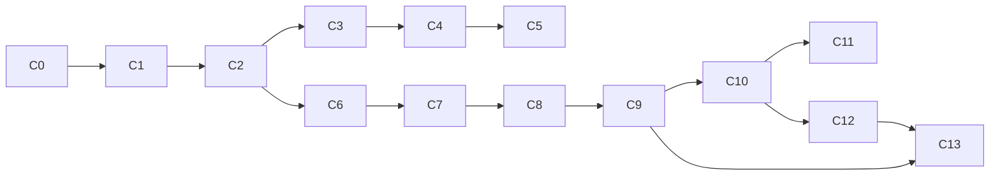

# Erganis Core — Implementation Plan (C0–C13)

> **Status:** **C0–C13 complete.**  
> **Architecture:** [`CORE-ARCHITECTURE.md`](./CORE-ARCHITECTURE.md) · **Product plan:** [§6 Core](../../../docs/erganis-product-plan.md#6-core)  
> **Other plans:** [Studio](../../studio/docs/STUDIO-IMPLEMENTATION-PLAN.md) · [Index](../../../docs/IMPLEMENTATION-PLANS.md)

This document consolidates all Core implementation phases (formerly `PHASE-0.md` … `PHASE-C11.md`) into a single reference.

---

## Overview

| Phase | Name | Status | Depends on |
|-------|------|--------|------------|
| **C0** | Shell | Done | — |
| **C1** | Auth | Done | C0 |
| **C2** | Loader + orchestrator | Done | C1 |
| **C3** | Orchestrator hardening | Done | C2 |
| **C4** | Migration validation | Done | C2, C3 |
| **C5** | Module enable/disable | Done | C4 |
| **C6** | FileStore | Done | C2 |
| **C7** | Surface API | Done | C6 |
| **C8** | Public API JWT | Done | C7 |
| **C9** | Platform services | Done | C8 |
| **C10** | UI composition | Done | C9 |
| **C11** | Sync API (stub) | Done | C10 |
| **C12** | UI skin & theme preview | Done | C10, S0 |
| **C13** | Codes provider adapter | Done | C9, C12 |



**Domain modules** (Documents, Inventory, Build, …) are **not** Core phases — see [Studio implementation plan](../../studio/docs/STUDIO-IMPLEMENTATION-PLAN.md).

---

## C0 — Shell

**Delivers:** Runnable Nest API, health checks, Postgres wiring, layered `core/services/` + `core/packages/typescript/`.

| Unit | Location |
|------|----------|
| Nest bootstrap | `services/src/main.ts`, `app.module.ts` |
| Health routes | `modules/health/` — `GET /health`, `GET /health/ready` |
| Database pool | `modules/database/database.service.ts` |
| Platform migrations | `data/migrations/`, `migration.runner.ts` |
| Shared types | `packages/typescript/` (`@erganis/platform`) |
| Docker Postgres | `infrastructure/docker/docker-compose.yml` |

**Environment:** `DATABASE_URL`, `API_PORT`, `MIGRATIONS_DIR`, `RUN_MIGRATIONS_ON_START`.

---

## C1 — Platform Auth

**Delivers:** OIDC v1 with local fallback, HttpOnly session cookies (web), JWT access tokens (public API), org/users/roles, domain JIT provisioning.

| Unit | Location | Tests |
|------|----------|-------|
| Public IDs + auth types | `packages/typescript/src/` | `public-id.spec.ts` |
| Auth schema | `data/migrations/001_platform_auth.sql` | `migration.runner.spec.ts` |
| Domain JIT | `auth/application/domain-jit.service.ts` | `domain-jit.service.spec.ts` |
| Password hashing | `auth/application/password.service.ts` | `password.service.spec.ts` |
| JWT + OIDC state | `auth/application/token.service.ts` | `token.service.spec.ts` |
| Sessions | `auth/application/session.service.ts` | `session.service.spec.ts` |
| OIDC providers | `auth/infrastructure/oidc-auth.provider.ts` | `oidc-auth.provider.spec.ts` |
| Repositories | `auth/infrastructure/*.repository.ts` | `*.repository.spec.ts` |
| Auth orchestration | `auth/application/auth.service.ts` | `auth.service.spec.ts` |
| HTTP routes | `auth/controllers/auth.controller.ts` | `auth.controller.spec.ts` |
| Session guard | `auth/guards/session.guard.ts` | `session.guard.spec.ts` |
| E2E | `services/test/auth.e2e-spec.ts` | local login, OIDC mock, JWT |

### Routes

- `POST /auth/local/:orgSlug/login` — local fallback (session cookie)
- `GET /auth/oidc/:orgSlug/start` — begin OIDC
- `GET /auth/oidc/:orgSlug/callback` — complete OIDC
- `GET /auth/me/:orgSlug` — session view
- `POST /auth/logout` — revoke session
- `POST /auth/token` — JWT from session or email/password

### Deferred

- SAML provider (pluggable pattern ready)
- Studio admin UI for org/role management
- Live Google/Microsoft IdP in CI (mock only)

---

## C2 — Module Loader + DAL + Envelope Smoke

**Delivers:** Module loading, shared DAL, orchestrator transactions, hello-world stub envelope smoke.

| Unit | Location |
|------|----------|
| DAL interfaces + `BaseRepository` | `packages/typescript/src/dal/` |
| PostgreSQL adapters | `data/dal/` (`@erganis/dal-postgres`) |
| Orchestration types | `packages/typescript/src/orchestration/` |
| Module manifest types | `packages/typescript/src/modules/` |
| Platform module registry | `data/migrations/002_platform_modules.sql` |
| Module loader | `services/src/modules/loader/` |
| Orchestrator + HTTP | `services/src/modules/orchestrator/` |
| Hello-world stub | `studio/modules/hello-world/` |
| E2E | `services/test/operations.e2e-spec.ts` |

### Architecture flow

1. **Discovery** — `ModuleDiscoveryService` scans `MODULES_ROOT` for `erganis.module.json`.
2. **Migrations** — Platform SQL on startup; module SQL per manifest after platform tables exist.
3. **Load** — `ModuleLoaderService` on `OnApplicationBootstrap`, registers handlers via `createRequire`.
4. **Execute** — `POST /operations/execute` (session) resolves steps, runs `phase: db` inside `PgUnitOfWorkFactory.runInTransaction`.

### Module migration policy

| Rule | Detail |
|------|--------|
| Core-owned execution | Only `ModuleMigrationService` applies module SQL |
| First-party | Single `migrations/` per module |
| Third-party | **Mandatory** `migrations/`; own schema only — **C4** enforces |
| Tracking | `platform.module_migrations` |

### Hello-world stub

- **Module:** `erganis.hello-world` · **Surface/action:** `stub.save` · **Handler:** `pingSave`
- Build: `cd studio/modules/hello-world && npm install && npm run build`

### Environment

`DATABASE_URL`, `MODULES_ROOT`, `RUN_MIGRATIONS_ON_START`, `AUTH_LOCAL_ENABLED`

---

## C3 — Orchestrator Hardening

**Delivers:** Entity locks/versions, partial outcomes, envelope JSON Schema.

| Unit | Location |
|------|----------|
| Entity lock tables | `data/migrations/003_platform_entity_locks.sql` |
| `EntityLockService` | `orchestrator/application/` |
| Orchestrator integration | `orchestrator.service.ts` |
| Partial outcomes | `@erganis/platform` `computeOutcome` |
| HTTP status mapping | `operations.controller.ts` — 201 success, 200 partial, 422 failed, 409 conflict |
| Envelope JSON Schema | `contracts/schemas/envelope/operation-envelope.schema.json` |

### Behavior

- **`entityVersion`** mismatch → **409** `VERSION_CONFLICT`
- **`entityPublicId`** on lockable actions → exclusive lock (`ENTITY_LOCK_TTL_SECONDS`, default 300s); held lock → **409** `LOCK_CONFLICT`
- After success/partial, version bumps; response includes **`entityVersion`**
- **`failureClass: optional`** → outcome **`partial`**, HTTP **200** (post-commit failure)
- **`failureClass: advisory`** → step **`warning`**

---

## C4 — Migration Validation

**Delivers:** Third-party mandatory `migrations/`, SQL schema allowlist.

| Unit | Location |
|------|----------|
| Validator | `loader/module-migration.validator.ts` |
| Integration | `ModuleMigrationService` |

### Rules

- Third-party paths (`…/third-party/…`) must have **`migrations/`**
- Third-party SQL cannot reference `platform.*` or first-party schemas (`hello_world`, `documents`, …)
- First-party: permissive (own schema by convention)

---

## C5 — Module Enable/Disable per Org

**Delivers:** Per-org module toggles, granular operation disable.

| Unit | Location |
|------|----------|
| Migration | `data/migrations/004_platform_org_modules.sql` |
| `OrgModuleRepository` | `loader/org-module.repository.ts` |
| `ModuleAccessService` | `loader/module-access.service.ts` |
| Admin API | `POST /admin/modules/:orgId/:moduleId/enable` |
| Orchestrator guard | `assertOperationAllowed` before execute |

Disabled module → **403** `MODULE_DISABLED`.

---

## C6 — FileStore

**Delivers:** Local file bytes under org-scoped paths.

| Unit | Purpose |
|------|---------|
| `LocalFileStoreService` | `{ERGANIS_DATA_ROOT}/{orgId}/{namespace}/` |
| `FilesController` | `POST /files/:orgSlug/upload`, `GET /files/:orgSlug/*` |
| `FileModule` | Wired in `AppModule` |

**Env:** `ERGANIS_DATA_ROOT`

```http
POST /files/acme/upload
{ "fileName": "cert.pdf", "contentType": "application/pdf", "dataBase64": "…" }
```

---

## C7 — Surface API

**Delivers:** Parallel module `load` handlers, composed response.

| Unit | Location |
|------|----------|
| `SurfaceLoadService` | `surface/surface-load.service.ts` |
| `SurfaceController` | `GET /surfaces/:surfaceId/load?orgSlug=` |

### Response shape

```json
{
  "surfaceId": "dashboard",
  "orgSlug": "acme",
  "modules": {
    "erganis.hello-world": { "hello-load": { "title": "Hello" } }
  }
}
```

Register load steps in manifest `operations` with `action: "load"`, `phase: "read"`.

---

## C8 — Public API JWT Guard

**Delivers:** Bearer JWT on public routes.

| Unit | Location |
|------|----------|
| `JwtAuthGuard` | `auth/guards/jwt-auth.guard.ts` |
| `PublicApiController` | `GET /public/v1/me` |

```http
GET /public/v1/me
Authorization: Bearer eyJhbG…
```

Invalid/missing token → **401**.

**Deferred:** API keys shape.

---

## C9 — Platform Services (Jobs, Outbox, Search)

**Delivers:** pg-boss jobs, outbox poller, event handlers, FTS search, operation audit log.

| Unit | Location |
|------|----------|
| Migrations | `005_platform_operations.sql`, `006_platform_search.sql` |
| Audit + outbox | `platform-services/` |
| pg-boss | `jobs/job-queue.service.ts`, `job-runner.service.ts` |
| Outbox poller | `outbox/outbox-poller.service.ts` |
| Event dispatch | `events/event-dispatcher.service.ts` |
| Search FTS | `search/search.service.ts`, `GET /search?orgSlug=&q=` |

### Runtime flow

Orchestrator → `recordOperation` → `operation_log` + `outbox_events` → poller → `EventDispatcher` → pg-boss `platform.search.touch` → search index.

### pg-boss queues

| Queue | Trigger |
|-------|---------|
| `platform.search.touch` | `operation.completed` outbox event |
| `platform.search.index` | `PlatformEventService.enqueueSearchIndex()` |
| `{moduleId}:{handler}` | Manifest `contributions.jobs` |

### Configuration

`JOBS_ENABLED`, `PGBOSS_SCHEMA`, `OUTBOX_ENABLED`, `OUTBOX_POLL_INTERVAL_MS`, `OUTBOX_BATCH_SIZE`

### Future work

- Transactional outbox in same DB transaction as orchestrator commit
- Module `contributions.events` wiring
- External webhook publisher
- Manifest `schedule` cron jobs
- Remove legacy `platform.job_queue` table

---

## C10 — UI Toolbox / Composition

**Delivers:** Layout slot registry and **C12 theme APIs** for Studio shell.

| Unit | Location |
|------|----------|
| `CompositionController` | `GET /composition/slots` |
| Theme APIs | See **C12** below |

Default slots: `shell.header`, `shell.sidebar`, `shell.main`, `dashboard.widget`. Studio **S0** maps module UI into these slots.

---

## C11 — Sync API (stub)

**Delivers:** Pull/push contract for offline-capable clients (in-memory stub).

| Endpoint | Purpose |
|----------|---------|
| `GET /sync/pull?orgSlug=&sinceVersion=` | Records newer than version |
| `POST /sync/push` | Optimistic concurrency; **409** `SYNC_CONFLICT` on mismatch |

**Note:** Production sync will tie into C3 entity locks/versions and module persistence.

---

## C12 — UI Skin & Theme Preview

**Delivers:** Org-scoped visual theming — **design tokens** + **component skins** + live preview.

| Unit | Location |
|------|----------|
| `007_platform_themes.sql` | `platform.org_themes` |
| `theme-defaults.ts` | Platform default tokens + slot skins |
| `OrgThemeRepository` | `composition/theme.repository.ts` |
| `ThemeResolutionService` | Merge platform → org → preview |
| `GET /composition/theme?orgSlug=` | Resolved theme for org |
| `POST /composition/theme/preview` | Ephemeral preview from draft JSON |
| `PUT /composition/theme?orgSlug=` | Persist org overrides |

---

## C13 — Codes Provider Adapter

**Delivers:** Versioned IBC / accessibility rule packs with sync job hook for Build (S-B2/S-B3).

| Unit | Location |
|------|----------|
| `008_platform_codes.sql` | `code_rule_packs`, `code_sync_log` |
| `CodeRuleRepository` | `codes/codes.repository.ts` |
| `CodesProviderService` | Query + seed + import |
| `CodesController` | `GET /codes/rules?jurisdiction=&edition=&topic=&ruleFamily=` |
| `platform.codes.sync` | pg-boss job — import payload rules or re-seed |

Bootstrap seed includes sample IBC occupancy/egress and accessibility clearance rules (2021/2017 editions). External API sync via job payload `{ source, rules: [...] }`.

### Deferred (post-Core)

- Transactional outbox in orchestrator transaction
- External code API vendor integration
- C11 persistent sync backing store

---

## Test map (Core)

| Area | Location |
|------|----------|
| Platform package | `packages/typescript/**/*.spec.ts` |
| Services unit | `services/src/**/*.spec.ts` |
| E2E | `services/test/*.e2e-spec.ts` |
| CI | Parent `.github/workflows/ci.yml` — Postgres service, Jest |

---

## Local dev quick start

```bash
cd core/infrastructure/docker && docker compose up -d postgres
cd ../../packages/typescript && npm run build
cd ../../../studio/modules/hello-world && npm install && npm run build
cd ../../../core/services && cp .env.example .env && npm run start:dev
```

See [`CORE-ARCHITECTURE.md`](./CORE-ARCHITECTURE.md) §11 for implementation examples.
