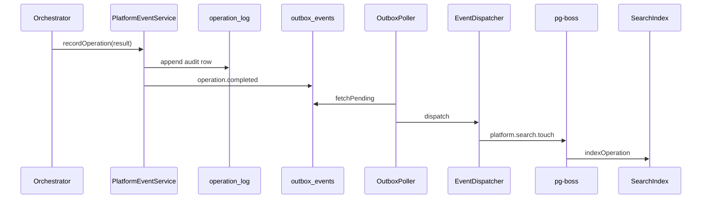

# Core C9 — Platform Services (Jobs, Outbox, Search)

> **Status:** Complete.  
> **Depends on:** [C8](./PHASE-C8.md).

## Deliverables

| Unit | Location | Purpose |
|------|----------|---------|
| `005_platform_operations.sql` | `data/migrations/` | `operation_log`, `outbox_events`, `job_queue` (legacy table) |
| `006_platform_search.sql` | `data/migrations/` | `search_index` with PostgreSQL FTS (`tsvector`) |
| `OperationLogRepository` | `platform-services/platform-repositories.ts` | Append-only operation audit |
| `OutboxRepository` | Same | Outbox enqueue + `fetchPending` / `markPublished` |
| `PlatformEventService` | `platform-event.service.ts` | Audit + outbox on execute; `enqueueJob` via pg-boss |
| `JobQueueService` | `jobs/job-queue.service.ts` | **pg-boss** worker runtime |
| `JobRunnerService` | `jobs/job-runner.service.ts` | Registers platform + module job handlers |
| `OutboxPollerService` | `outbox/outbox-poller.service.ts` | Polls unpublished outbox rows |
| `EventDispatcherService` | `events/event-dispatcher.service.ts` | In-process event handler registry |
| `PlatformEventHandlers` | `events/platform-event-handlers.ts` | `operation.completed` → search index job |
| `SearchService` | `search/search.service.ts` | FTS upsert + query |
| `SearchController` | `GET /search?orgSlug=&q=` | Session-authenticated search |

## Runtime flow



## pg-boss jobs

| Queue name | Handler | Trigger |
|------------|---------|---------|
| `platform.search.touch` | Index operation metadata for org-wide search | Outbox `operation.completed` |
| `platform.search.index` | Generic document upsert | `PlatformEventService.enqueueSearchIndex()` |
| `{moduleId}:{handler}` | Module manifest `contributions.jobs` | Module-defined |

## Module job registration

Manifest example:

```yaml
contributions:
  jobs:
    - jobId: inventory.reindex
      handler: reindexInventory
```

Export from module entry point:

```javascript
module.exports = {
  handlers: { pingSave },
  jobs: { reindexInventory: async (payload) => { /* ... */ } },
};
```

## Search API

```http
GET /search?orgSlug=acme&q=stub.save
Cookie: erganis_session=…
```

```json
{
  "orgSlug": "acme",
  "query": "stub.save",
  "hits": [
    {
      "entityType": "operation",
      "entityPublicId": "op_abc",
      "title": "stub.save",
      "body": "success",
      "rank": 0.12
    }
  ]
}
```

## Configuration

| Env var | Default | Purpose |
|---------|---------|---------|
| `JOBS_ENABLED` | `true` | Start pg-boss on boot |
| `PGBOSS_SCHEMA` | `pgboss` | pg-boss Postgres schema |
| `OUTBOX_ENABLED` | `true` | Start outbox poller |
| `OUTBOX_POLL_INTERVAL_MS` | `2000` | Poller interval |
| `OUTBOX_BATCH_SIZE` | `25` | Events per poll |

## Future work

- Transactional outbox in same DB transaction as orchestrator commit
- Module `contributions.events` wired into `EventDispatcher`
- Outbox publisher for external webhooks (beyond in-process handlers)
- pg-boss scheduled jobs from manifest `schedule` field
- Deprecate / remove `platform.job_queue` table

## References

- Product plan C9
- `CORE-ARCHITECTURE.md` §8 Nest module wiring
